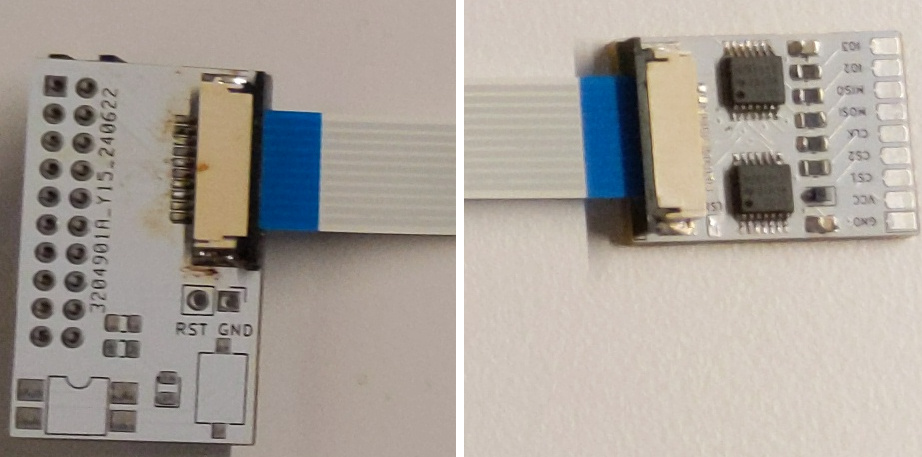

The picture shows the spi_implant on the right and the dediprog_interface on the left. The dediprog_interface is connected to the flasher (for example a dediprog). The spi_implant is supposed to be connected to the actual flash chip. The flat cable is connecting both boards. It was originally made to flash laptops and this is why it is composed of two boards (the flat cable can be more easily routed out of the laptop case).
